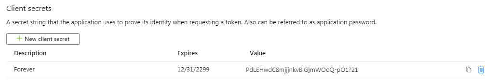

# <a name="how-to-run-the-completed-project"></a><span data-ttu-id="bd3f6-101">Выполнение завершенного проекта</span><span class="sxs-lookup"><span data-stu-id="bd3f6-101">How to run the completed project</span></span>

## <a name="prerequisites"></a><span data-ttu-id="bd3f6-102">Предварительные требования</span><span class="sxs-lookup"><span data-stu-id="bd3f6-102">Prerequisites</span></span>

<span data-ttu-id="bd3f6-103">Чтобы запустить завершенный проект в этой папке, вам потребуются следующие компоненты:</span><span class="sxs-lookup"><span data-stu-id="bd3f6-103">To run the completed project in this folder, you need the following:</span></span>

- <span data-ttu-id="bd3f6-104">[Пакет SDK .NET Core](https://dotnet.microsoft.com/download) , установленный на компьютере для разработки.</span><span class="sxs-lookup"><span data-stu-id="bd3f6-104">The [.NET Core SDK](https://dotnet.microsoft.com/download) installed on your development machine.</span></span> <span data-ttu-id="bd3f6-105">( **Примечание:** данное руководство написано в пакете SDK для .NET Core версии 3.1.201.</span><span class="sxs-lookup"><span data-stu-id="bd3f6-105">( **Note:** This tutorial was written with .NET Core SDK version 3.1.201.</span></span> <span data-ttu-id="bd3f6-106">Действия, описанные в этом руководстве, могут работать с другими версиями, но не тестировались.</span><span class="sxs-lookup"><span data-stu-id="bd3f6-106">The steps in this guide may work with other versions, but that has not been tested.)</span></span>
- <span data-ttu-id="bd3f6-107">Личная учетная запись Майкрософт с почтовым ящиком на Outlook.com или рабочей или учебной учетной записью Майкрософт.</span><span class="sxs-lookup"><span data-stu-id="bd3f6-107">Either a personal Microsoft account with a mailbox on Outlook.com, or a Microsoft work or school account.</span></span>

<span data-ttu-id="bd3f6-108">Если у вас нет учетной записи Майкрософт, у вас есть несколько вариантов для получения бесплатной учетной записи:</span><span class="sxs-lookup"><span data-stu-id="bd3f6-108">If you don't have a Microsoft account, there are a couple of options to get a free account:</span></span>

- <span data-ttu-id="bd3f6-109">Вы можете [зарегистрироваться для создания новой личной учетной записи Майкрософт](https://signup.live.com/signup?wa=wsignin1.0&rpsnv=12&ct=1454618383&rver=6.4.6456.0&wp=MBI_SSL_SHARED&wreply=https://mail.live.com/default.aspx&id=64855&cbcxt=mai&bk=1454618383&uiflavor=web&uaid=b213a65b4fdc484382b6622b3ecaa547&mkt=E-US&lc=1033&lic=1).</span><span class="sxs-lookup"><span data-stu-id="bd3f6-109">You can [sign up for a new personal Microsoft account](https://signup.live.com/signup?wa=wsignin1.0&rpsnv=12&ct=1454618383&rver=6.4.6456.0&wp=MBI_SSL_SHARED&wreply=https://mail.live.com/default.aspx&id=64855&cbcxt=mai&bk=1454618383&uiflavor=web&uaid=b213a65b4fdc484382b6622b3ecaa547&mkt=E-US&lc=1033&lic=1).</span></span>
- <span data-ttu-id="bd3f6-110">Вы можете [зарегистрироваться в программе для разработчиков office 365](https://developer.microsoft.com/office/dev-program) , чтобы получить бесплатную подписку на Office 365.</span><span class="sxs-lookup"><span data-stu-id="bd3f6-110">You can [sign up for the Office 365 Developer Program](https://developer.microsoft.com/office/dev-program) to get a free Office 365 subscription.</span></span>

## <a name="register-a-web-application-with-the-azure-active-directory-admin-center"></a><span data-ttu-id="bd3f6-111">Регистрация веб-приложения с помощью центра администрирования Azure Active Directory</span><span class="sxs-lookup"><span data-stu-id="bd3f6-111">Register a web application with the Azure Active Directory admin center</span></span>

1. <span data-ttu-id="bd3f6-112">Откройте браузер и перейдите к [Центру администрирования Azure Active Directory](https://aad.portal.azure.com).</span><span class="sxs-lookup"><span data-stu-id="bd3f6-112">Open a browser and navigate to the [Azure Active Directory admin center](https://aad.portal.azure.com).</span></span> <span data-ttu-id="bd3f6-113">Войдите с помощью **личной учетной записи** (т.е. учетной записи Microsoft) или **рабочей (учебной) учетной записи**.</span><span class="sxs-lookup"><span data-stu-id="bd3f6-113">Login using a **personal account** (aka: Microsoft Account) or **Work or School Account**.</span></span>

1. <span data-ttu-id="bd3f6-114">Выберите **Azure Active Directory** на панели навигации слева, затем выберите **Регистрация приложений** в разделе **Управление**.</span><span class="sxs-lookup"><span data-stu-id="bd3f6-114">Select **Azure Active Directory** in the left-hand navigation, then select **App registrations** under **Manage**.</span></span>

    

1. <span data-ttu-id="bd3f6-116">Выберите **Новая регистрация**.</span><span class="sxs-lookup"><span data-stu-id="bd3f6-116">Select **New registration**.</span></span> <span data-ttu-id="bd3f6-117">На странице **Зарегистрировать приложение** задайте необходимые значения следующим образом.</span><span class="sxs-lookup"><span data-stu-id="bd3f6-117">On the **Register an application** page, set the values as follows.</span></span>

    - <span data-ttu-id="bd3f6-118">Введите **имя** `ASP.NET Core Graph Tutorial`.</span><span class="sxs-lookup"><span data-stu-id="bd3f6-118">Set **Name** to `ASP.NET Core Graph Tutorial`.</span></span>
    - <span data-ttu-id="bd3f6-119">Введите **поддерживаемые типы учетных записей** для **учетных записей в любом каталоге организаций и личных учетных записей Microsoft**.</span><span class="sxs-lookup"><span data-stu-id="bd3f6-119">Set **Supported account types** to **Accounts in any organizational directory and personal Microsoft accounts**.</span></span>
    - <span data-ttu-id="bd3f6-120">В разделе **URI адрес перенаправления** введите значение в первом раскрывающемся списке `Web` и задайте значение `https://localhost:5001/`.</span><span class="sxs-lookup"><span data-stu-id="bd3f6-120">Under **Redirect URI** , set the first drop-down to `Web` and set the value to `https://localhost:5001/`.</span></span>

    

1. <span data-ttu-id="bd3f6-122">Нажмите **Зарегистрировать**.</span><span class="sxs-lookup"><span data-stu-id="bd3f6-122">Select **Register**.</span></span> <span data-ttu-id="bd3f6-123">На странице **Tutorial основного графа ASP.NET** СКОПИРУЙТЕ значение **идентификатора Application (Client)** и сохраните его, он понадобится на следующем шаге.</span><span class="sxs-lookup"><span data-stu-id="bd3f6-123">On the **ASP.NET Core Graph Tutorial** page, copy the value of the **Application (client) ID** and save it, you will need it in the next step.</span></span>

    

1. <span data-ttu-id="bd3f6-125">Выберите **Проверка подлинности** в разделе **Управление**.</span><span class="sxs-lookup"><span data-stu-id="bd3f6-125">Select **Authentication** under **Manage**.</span></span> <span data-ttu-id="bd3f6-126">В разделе **URI перенаправления** Добавьте URI со значением `https://localhost:5001/signin-oidc` .</span><span class="sxs-lookup"><span data-stu-id="bd3f6-126">Under **Redirect URIs** add a URI with the value `https://localhost:5001/signin-oidc`.</span></span>

1. <span data-ttu-id="bd3f6-127">Задайте для параметра **URL-адрес выхода** значение `https://localhost:5001/signout-oidc` .</span><span class="sxs-lookup"><span data-stu-id="bd3f6-127">Set the **Logout URL** to `https://localhost:5001/signout-oidc`.</span></span>

1. <span data-ttu-id="bd3f6-128">Найдите раздел **Неявное представление** и включите **Маркеры идентификации**.</span><span class="sxs-lookup"><span data-stu-id="bd3f6-128">Locate the **Implicit grant** section and enable **ID tokens**.</span></span> <span data-ttu-id="bd3f6-129">Выберите **Сохранить**.</span><span class="sxs-lookup"><span data-stu-id="bd3f6-129">Select **Save**.</span></span>

    

1. <span data-ttu-id="bd3f6-131">Выберите **Сертификаты и секреты** в разделе **Управление**.</span><span class="sxs-lookup"><span data-stu-id="bd3f6-131">Select **Certificates & secrets** under **Manage**.</span></span> <span data-ttu-id="bd3f6-132">Нажмите кнопку **Новый секрет клиента**.</span><span class="sxs-lookup"><span data-stu-id="bd3f6-132">Select the **New client secret** button.</span></span> <span data-ttu-id="bd3f6-133">Введите значение в поле **Описание** и выберите один из вариантов **истечения срока действия** , а затем нажмите кнопку **добавить**.</span><span class="sxs-lookup"><span data-stu-id="bd3f6-133">Enter a value in **Description** and select one of the options for **Expires** and select **Add**.</span></span>

    

1. <span data-ttu-id="bd3f6-135">Скопируйте значение секрета клиента, а затем покиньте эту страницу.</span><span class="sxs-lookup"><span data-stu-id="bd3f6-135">Copy the client secret value before you leave this page.</span></span> <span data-ttu-id="bd3f6-136">Оно вам понадобится на следующем шаге.</span><span class="sxs-lookup"><span data-stu-id="bd3f6-136">You will need it in the next step.</span></span>

    > [!IMPORTANT]
    > <span data-ttu-id="bd3f6-137">Это секрет клиента, он никогда не отображается еще раз, поэтому убедитесь, что вы скопировали его.</span><span class="sxs-lookup"><span data-stu-id="bd3f6-137">This client secret is never shown again, so make sure you copy it now.</span></span>

    

## <a name="configure-the-sample"></a><span data-ttu-id="bd3f6-139">Настройка примера</span><span class="sxs-lookup"><span data-stu-id="bd3f6-139">Configure the sample</span></span>

1. <span data-ttu-id="bd3f6-140">Откройте интерфейс командной строки (CLI) в каталоге, где находится **графтуториал. csproj** , и выполните следующие команды, заменив `YOUR_APP_ID` идентификатор приложения на портале Azure и `YOUR_APP_SECRET` указав секрет вашего приложения.</span><span class="sxs-lookup"><span data-stu-id="bd3f6-140">Open your command line interface (CLI) in the directory where **GraphTutorial.csproj** is located, and run the following commands, substituting `YOUR_APP_ID` with your application ID from the Azure portal, and `YOUR_APP_SECRET` with your application secret.</span></span>

    ```Shell
    dotnet user-secrets init
    dotnet user-secrets set "AzureAd:ClientId" "YOUR_APP_ID"
    dotnet user-secrets set "AzureAd:ClientSecret" "YOUR_APP_SECRET"
    ```

## <a name="run-the-sample"></a><span data-ttu-id="bd3f6-141">Запуск приложения</span><span class="sxs-lookup"><span data-stu-id="bd3f6-141">Run the sample</span></span>

<span data-ttu-id="bd3f6-142">Чтобы запустить приложение, в интерфейсе командной строки выполните следующую команду.</span><span class="sxs-lookup"><span data-stu-id="bd3f6-142">In your CLI, run the following command to start the application.</span></span>

```Shell
dotnet run
```
